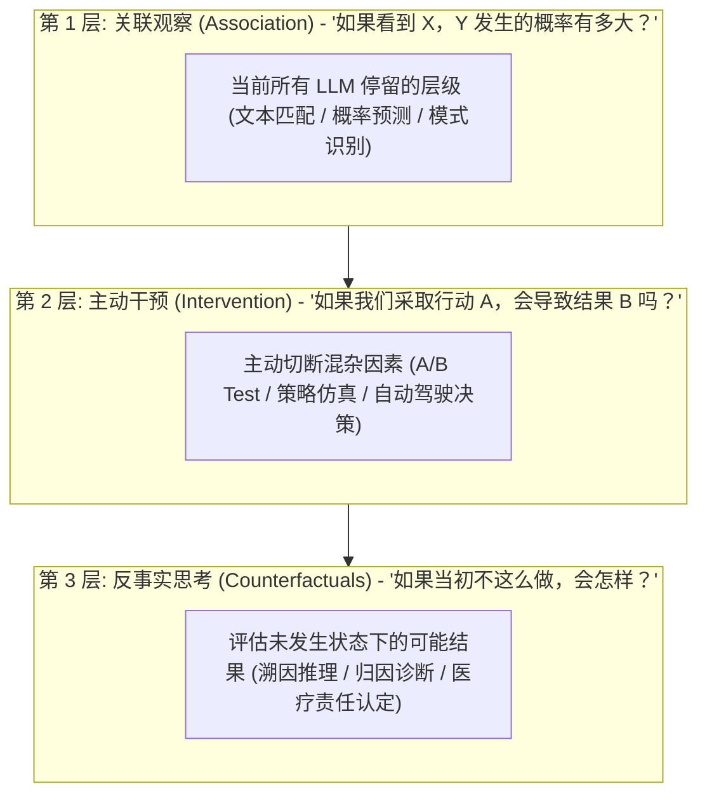

# 【今夜科技谈】因果大模型：下一场 AI 范式之争与反事实推理演进

> **主办方/公众号**：极客公园 / Founder Park  
> **直播栏目**：`《今夜科技谈》`  
> **核心标签**：`因果大模型 (Causal LLM)` `因果推断 (Causal Inference)` `消除幻觉` `干预与反事实推理` `Judea Pearl 理论`

---

## 📺 课程与学习资源导航

- **📺 官方视频号回放**：微信视频号搜索 `极客公园` -> 点击“直播回放” -> 搜索《因果大模型：下一场 AI 范式之争？》
- **📺 B站精选切片**：[Bilibili - Founder Park 官方：因果推理与大模型下一代范式研讨](https://space.bilibili.com/2099307409)
- **💻 理论与开源工具库**：
  - 微软因果机器学习库：[DoWhy (GitHub)](https://github.com/py-why/dowhy) / [EconML](https://github.com/py-why/econml)
  - 结构因果模型框架：[CausalML (GitHub)](https://github.com/uber/causalml)

---

## 1. 为什么“统计相关性”救不了大模型的幻觉与不可解释性？

当前所有主流大模型（GPT-4、Claude、Qwen、DeepSeek）底层均基于自回归概率预测：

$$P(W_t | W_1, W_2, \dots, W_{t-1})$$

这种纯统计概率驱动的机制存在不可逾越的致命短板：

```mermaid
graph TD
    A[当前 Transformer 自回归机制] --> B[本质: 拟合海量语料中的【词共现统计相关性】]
    B --> C[混淆因果关联 (Confounding Bias)]
    B --> D[无法执行【干预 (Intervention)】与【反事实推理 (Counterfactual)】]
    B --> E[外推泛化失败 (超出训练集分布 OOD 时胡言乱语)]
    C & D & E ==> F[产生根本性幻觉与逻辑不可解释性]
```

> **经典谬误案例**：统计上“公鸡打鸣”与“太阳升起”高度正相关，纯统计大模型容易在复杂推理中推导出“杀了公鸡，太阳就不会升起”的荒谬结论，因为它缺乏底层的**结构因果模型（Structural Causal Model, SCM）**。

---

## 2. Judea Pearl 因果之梯（Ladder of Causation）在大模型中的映射



---

## 3. 因果大模型（Causal LLM）融合架构设计

为了实现真正具备逻辑自洽与归因能力的下一代 AI 系统，工业界与学术界正加速推进**大模型与结构因果模型（SCM）的双脑融合架构**：

```mermaid
flowchart LR
    subgraph NeuroSymbolic["因果大模型融合拓扑"]
        Input[用户复杂问题 / 故障排查请求] --> LLM_Parser[神经大脑: LLM 语义理解与实体抽取]
        LLM_Parser --> DAG_Builder[因果图生成器: 自动提取因果关系 DAG]
        DAG_Builder --> SCM_Engine[符号大脑: 因果推断引擎 (Do-Calculus / DoWhy)]
        SCM_Engine -->|去除混杂变量 + 反事实模拟| FactVerification[因果逻辑真值校验]
        FactVerification --> LLM_Generator[生成具备因果证明链的权威结论]
    end
```

### 3.1 基于 Python DoWhy 的因果图验证核心代码示例

```python
import dowhy
from dowhy import CausalModel
import pandas as pd

# 1. 模拟企业决策数据（广告投放 vs 销量增长，排除季节混杂因素）
data = pd.read_csv("enterprise_marketing_data.csv")

# 2. 将大模型生成的因果假设构建为因果图 (DOT 格式)
causal_graph = """
digraph {
    MarketingSpend -> SalesRevenue;
    Seasonality -> MarketingSpend;
    Seasonality -> SalesRevenue;
    CompetitorDiscount -> SalesRevenue;
}
"""

# 3. 构建因果模型并执行 Do 算子干预估计
model = CausalModel(
    data=data,
    treatment='MarketingSpend',
    outcome='SalesRevenue',
    graph=causal_graph.replace("\n", " ")
)

# 识别因果效应 (自动切断混杂路径)
identified_estimand = model.identify_effect(proceed_when_unidentifiable=True)

# 估计真实的因果干预效应 (而非单纯相关性)
estimate = model.estimate_effect(
    identified_estimand,
    method_name="backdoor.linear_regression"
)

print(f"[Causal Effect]: 每增加1单位营销投入，真实因果带来的净销售额提升为: {estimate.value}")
```

---

## 4. 行业应用前景与落地场景

1. **医疗精准诊断与药物靶点发现**：
   - 区分“伴随症状（Correlation）”与“致病机理（Causation）”，避免模型因病例共现给出错误处方。
2. **金融风控与反欺诈根因分析**：
   - 在洗钱与欺诈链路中，排除大量噪音交易，精准锁定引发风险的根本操纵节点。
3. **复杂工业与 IT 根因定位（Root Cause Analysis, RCA）**：
   - 在微服务数百个告警齐发时，利用因果图自动溯源最底层的故障源头（如数据库死锁引起下游级联超时）。

---

## 5. 直播互动 Q&A 精选

- **Q：强化学习（RL）能自动学出因果关系吗？**
  - **嘉宾解答**：强化学习通过与环境交互（Trial and Error）能够触及第 2 层“干预（Intervention）”，但如果没有显式的因果先验与图结构约束，在大规模复杂状态空间中仍会被虚假奖励（Spurious Reward）所误导。将**因果图作为先验注入 RL 奖励函数**是当前最前沿的研究热点。
