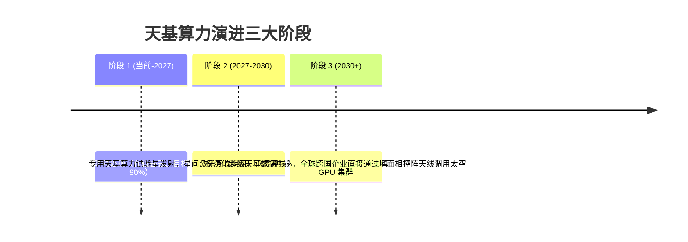

# 【今夜科技谈】SpaceX 的太空算力新故事：天基数据中心与星载 AI 计算架构

> **主办方/公众号**：极客公园 / Founder Park  
> **直播栏目**：`《今夜科技谈》`  
> **核心标签**：`太空算力 (Orbital Compute)` `SpaceX 星链` `天基数据中心` `太阳能与辐射散热` `星间激光互联`

---

## 📺 课程与学习资源导航

- **📺 官方视频号回放**：微信视频号搜索 `极客公园` -> 点击“直播回放” -> 搜索《SpaceX 的太空算力新故事》
- **📺 B站精选切片**：[Bilibili - Founder Park 官方：太空算力与天基计算中心深度探讨](https://space.bilibili.com/2099307409)
- **📦 行业前沿研报**：天基分布式计算网络与空间低功耗 AI 芯片白皮书

---

## 1. 为什么地球上的算力中心正在逼近物理极限？

大模型爆发对全球算力集群的能耗与基础设施提出了前所未有的极限挑战：

```mermaid
graph TD
    A[地球数据中心的三大物理墙] --> B[1. 电力墙 (Power Wall): 现代 AI 万卡集群单点功耗达数十兆瓦，电网承载力见顶]
    A --> C[2. 散热墙 (Cooling Wall): 液冷能耗极高，且受环境水资源与环保指标严格限制]
    A --> D[3. 空间与地缘墙 (Land & Geopolitics): 土地征用成本昂贵，跨国网络主权壁垒严重]
```

### 太空环境的天然“算力天堂”优势
1. **取之不尽的太阳能**：在近地轨道（LEO），太阳能辐射强度比地球表面高 30%~40%，且没有昼夜与阴雨天气阻挡（配置向日同步轨道）。
2. **极低环境背景温度**：深空背景温度接近绝对零度（~3K），理论上拥有极高的辐射散热温差。
3. **星链（Starlink）激光骨干网**：星间激光通信速度接近真空中光速（$3 \times 10^8 \text{ m/s}$），比海底光纤快 **40% 以上**，跨大洲传输延迟更低。

---

## 2. 天基数据中心（Orbital Data Center）拓扑架构设计

```mermaid
flowchart TB
    subgraph SpaceLayer["1. 轨道算力星群 (LEO Orbital Compute Cluster)"]
        Sat1[卫星节点 A: 抗辐射 GPU 模组] <==>|星间激光互联 (ISL 100Gbps+)| Sat2[卫星节点 B: 抗辐射 GPU 模组]
        Sat2 <==>|星间激光互联| Sat3[卫星节点 C: 存储与聚合节点]
        
        SolarPanel[大面积柔性太阳能帆板] --> PowerSystem[直接高压直流供电 (HVDC)]
        PowerSystem --> Sat1 & Sat2 & Sat3
        
        Radiator[回路热管 + 空间辐射散热板] <--> Sat1 & Sat2 & Sat3
    end

    subgraph GroundLink["2. 天地协同链路 (Ground-to-Space Feeder Link)"]
        Sat3 <==>|Ka/V 波段高速相控阵馈电链路| GroundStation[地面骨干网接入站]
    end

    subgraph EarthLayer["3. 地面业务分发 (Earth Client Layer)"]
        GroundStation --> EnterpriseCloud[企业云 / 边缘数据中心 / 终端用户]
    end
```

---

## 3. 天基算力落地的四大硬核工程挑战

| 挑战维度 | 物理/工程瓶颈 | 解决方案与前沿技术 |
| :--- | :--- | :--- |
| **高能宇宙射线与辐射** | 质子与重离子辐射导致半导体产生单粒子翻转（SEU）甚至芯片物理击穿。 | 空间级抗辐射加固封装（Rad-Hard）、三模冗余（TMR）容错校验算法、纳米级金刚石散热衬底。 |
| **真空无空气对流散热** | 太空处于真空状态，无法使用风冷或传统对流散热，热量完全依赖热辐射（$E = \epsilon \sigma T^4$）。 | 展开式超大面积辐射散热翼板、相变材料（PCM）蓄热与微通道回路热管（LHP）。 |
| **发射载荷与发射成本** | 发射 1kg 载荷到轨道的传统成本高达数万美元。 | 依托 SpaceX Starship（星舰）完全可重复使用技术，将单公斤入轨成本压低至 **$100 美元以下**。 |
| **在轨维护与生命周期** | 硬件故障无法人工上天更换显卡。 | 模块化可插拔计算载荷、分布式软硬件容错降级策略（N+K 容错）。 |

---

## 4. 商业落地阶段推演



---

## 5. 直播互动 Q&A 精选

- **Q：在太空做大模型训练，延迟会不会太高？**
  - **嘉宾解答**：**大模型分布式预训练本质是吞吐敏感型（Throughput-intensive）而非延迟敏感型**。只要星间激光网络（ISL）带宽足够大（数百 Gbps），数百毫秒的天地延迟对持续几个月的模型训练完全没有影响，而节省下来的地表电力与水资源成本是以十亿美金计的。
