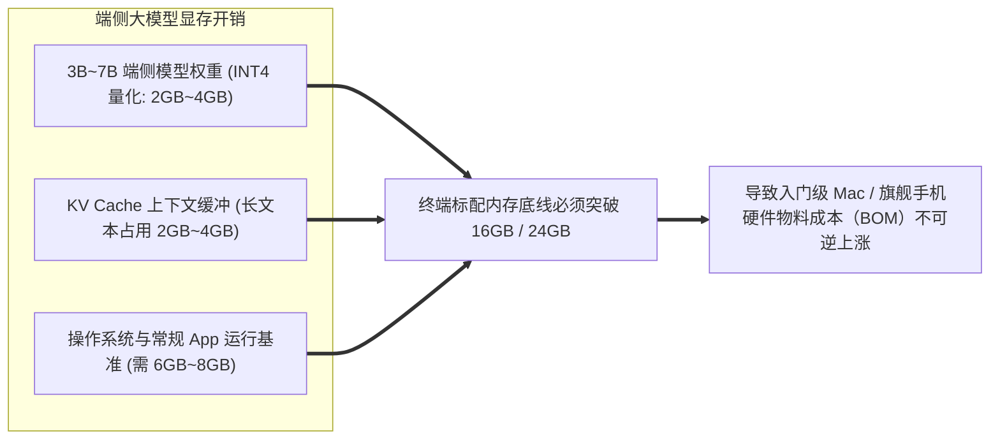

# 【今夜科技谈】端侧 AI 与苹果系统级智能体架构演进

> **主办方/公众号**：极客公园 / Founder Park  
> **直播栏目**：`《今夜科技谈》`  
> **核心标签**：`端侧大模型 (On-Device AI)` `Apple Intelligence` `统一内存 (UMA)` `私有云计算 (PCC)` `系统级智能体`

---

## 📺 课程与学习资源导航

- **📺 官方视频号回放**：微信视频号搜索 `极客公园` -> 点击“直播回放” -> 搜索《Mac 涨价，iPhone 还远吗？》/《WWDC26 与库克的谢幕演讲》
- **📺 B站精选切片**：[Bilibili - Founder Park 官方：苹果端侧 AI 与智能体架构](https://space.bilibili.com/2099307409)
- **📦 官方技术白皮书**：[Apple Private Cloud Compute Security Guide](https://security.apple.com/blog/private-cloud-compute/)

---

## 1. 为什么大模型时代苹果设备必须标配大内存？（硬件成本真相）

直播中深入拆解了端侧 AI 爆发后对移动与 PC 终端硬件架构的根本性重塑：



1. **统一内存架构（UMA）的降维打击**：苹果 Apple Silicon（M系列/A系列）芯片的 CPU、GPU 与 NPU（Neural Engine）共享同一块高带宽内存池（高达 100GB/s~800GB/s 带宽），**彻底消除了 PCIe 数据搬运开销**。
2. **端侧推理的内存带宽瓶颈**：Token 生成速度直接受限于内存带宽（$\text{Throughput} \propto \frac{\text{Memory Bandwidth}}{\text{Model Size}}$），使得高带宽内存成为端侧最核心的护城河。

---

## 2. 苹果系统级智能体端云协同架构拓扑

```mermaid
flowchart TB
    subgraph DeviceLayer["1. iPhone / Mac 本地端侧 (On-Device Security Enclave)"]
        UserIntent[用户跨 App 指令 / 语音指令] --> SemanticIndex[语义语义索引库: 屏幕上下文 + 个人知识图谱]
        SemanticIndex --> LocalRouter{端侧智能路由器}
        
        LocalRouter -->|日常小任务/高敏感数据| OnDeviceLLM[本地 3B 参数 AFM 基础模型 (适配 Neural Engine)]
        OnDeviceLLM --> AppIntents[App Intents 跨应用动作执行引擎]
    end

    subgraph PCCLayer["2. 私有云计算集群 (Private Cloud Compute - PCC)"]
        LocalRouter -->|复杂逻辑/深度推理| SecureEnclaveNet[端到端加密通道 (TLS + 硬件证书验证)]
        SecureEnclaveNet --> CloudNode[苹果自研 M 系列芯片云服务器]
        CloudNode --> LargeCloudModel[大规模云端大模型]
        
        subgraph SecurityGuarantee["不可篡改隐私保证"]
            StatelessCompute[无状态执行: 数据用完即焚 (No Disk Logging)]
            InspectableLog[第三方安全专家可公开审计固件 (Publicly Verifiable)]
        end
        CloudNode -.-> SecurityGuarantee
    end

    LargeCloudModel -->|加密返回结果| LocalRouter
    AppIntents --> FinishedAction[无缝完成跨 App 复杂协同操作]
```

---

## 3. 系统级智能体与普通 App Agent 的本质区别

| 对比维度 | 传统第三方 App 内智能体 | 苹果系统级智能体（System Agent） |
| :--- | :--- | :--- |
| **感知范围** | 仅限于单个 App 内部数据。 | **屏幕全局感知（Screen Awareness）** + 系统通知 + 跨 App 剪贴板。 |
| **动作执行能力** | 只能调用自身的公开 API。 | 通过 **App Intents 协议** 穿透所有第三方 App（如自动在小红书搜攻略并保存到备忘录）。 |
| **隐私安全基线** | 数据上传至第三方私有服务器。 | **端侧就地处理 + 私有云计算（PCC）硬件级隐私保护**。 |

---

## 4. 生产与开发最佳实践：开发者如何适配 App Intents

第三方应用若想被系统智能体自动调用，必须声明强类型的 App Intent：

```swift
import AppIntents

// 声明一个可被系统智能体自动理解与调用的操作
struct CreateExpenseRecordIntent: AppIntent {
    static var title: LocalizedStringResource = "创建记账记录"
    static var description = IntentDescription("在财务 App 中自动记录一笔消费")

    @Parameter(title: "金额", description: "消费金额数值")
    var amount: Double

    @Parameter(title: "消费类别", description: "例如餐饮、交通、购物")
    var category: String

    @Parameter(title: "备注", description: "详细说明")
    var note: String?

    // 智能体触发执行逻辑
    func perform() async throws -> some IntentResult {
        let success = await ExpenseDatabase.shared.save(amount: amount, category: category, note: note)
        if success {
            return .result(dialog: "已成功为您记录一笔 \(amount) 元的 \(category) 支出。")
        } else {
            return .result(dialog: "记账失败，请检查账户余额。")
        }
    }
}
```

---

## 5. 直播互动 Q&A 精选

- **Q：端侧 3B 模型能力远不如云端几百亿的大模型，真的能好用吗？**
  - **嘉宾解答**：**端侧模型不需要当“百科全书”，它只需要当“意图翻译器”**。端侧 3B 模型结合设备上的个人知识图谱（日历、通讯录、邮件、屏幕当前文字），其在“帮我把昨天张三发的文件发给李四”这类高频私密任务上的精准度，远超不知用户上下文的万亿公网大模型。
