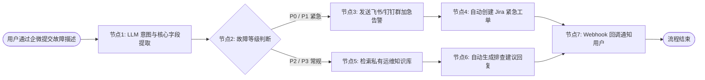

# 企业级自动化 Agent 工作流编排与插件落地

> **主办方/公众号**：Dify.AI 官方社区 / 扣子 Coze 开发者社区  
> **分享主题**：基于可视化工作流（Workflow）的企业级多 Agent 编排与内部 ERP/CRM API 闭环落地  
> **核心标签**：`Dify 工作流` `企业插件 (Tools)` `OpenAPI 规范` `条件分支与循环` `企业级系统集成`

---

## 📺 课程与学习资源导航

- **📺 官方高清视频回放**：[Bilibili - Dify官方频道：大模型应用与Workflow实战系列](https://space.bilibili.com/1529124430) / [Dify 视频号直播合集](https://dify.ai/)
- **📦 官方文档与案例库**：[Dify.AI 官方中文文档](https://docs.dify.ai/v/zh-hans) / [扣子官方开发指南](https://www.coze.cn/docs)
- **💻 开源工具与参考仓库**：
  - 大模型应用编排引擎：[langgenius/dify (GitHub)](https://github.com/langgenius/dify)
  - 企业集成插件集：[dify-plugins (GitHub)](https://github.com/langgenius/dify-plugins)

---

## 1. 为什么“可视化工作流 (Workflow)”优于“黑盒自主 Agent”？

在企业严肃业务环境（金融结算、工单流转、采购审批）中，纯自主 Agent（如 AutoGPT）因其随机性与不可控性几乎无法直接投产：

```mermaid
graph TD
    subgraph AutonomousAgent["纯自主 Agent (不可控)"]
        A1[用户指令] --> A2{大模型自由发散调用工具}
        A2 --> A3[调用顺序随机 / 参数格式错误 / 难以排查故障]
    end

    subgraph DeterministicWorkflow["确定性工作流 Workflow (企业级强可控)"]
        W1[事件触发 (Webhook / API)] --> W2[结构化参数提取 (LLM Node)]
        W2 --> W3{业务规则条件分支 (IF/ELSE)}
        W3 -->|合规| W4[调用企业 OA/ERP 写入 (Tool Node)]
        W3 -->|异常| W5[告警推送通知钉钉/企微 (HTTP Node)]
    end
```

- **核心原则**：**确定性的业务逻辑用代码/分支节点固定，不确定性的非结构化文本处理交给 LLM 节点**。

---

## 2. 企业智能运维/工单流转端到端工作流拓扑



---

## 3. 企业自定义工具（Custom Tool）接入规范

通过 OpenAPI 3.0 标准 Swagger Schema，将企业内部微服务无缝暴露给工作流中的智能体：

### 3.1 OpenAPI 规范 YAML 定义示例（内部 CRM 接口）

```yaml
openapi: 3.0.1
info:
  title: Enterprise CRM Internal API
  description: 用于查询与创建客户销售线索的企业内部接口
  version: 1.0.0
servers:
  - url: https://crm-gateway.internal.corp/api/v1
paths:
  /leads/query:
    get:
      summary: 根据手机号或公司名查询线索状态
      operationId: queryLeadByKeyword
      parameters:
        - name: keyword
          in: query
          required: true
          schema:
            type: string
          description: 客户手机号或企业全称
      responses:
        '200':
          description: 查询成功
          content:
            application/json:
              schema:
                type: object
                properties:
                  lead_id:
                    type: string
                  status:
                    type: string
                    enum: [NEW, CONTACTED, CLOSED]
                  owner_name:
                    type: string
```

---

### 3.2 节点数据聚合与多轮转换代码片段 (Python 节点)

在工作流中用于清洗提取结果并保证输出结构化：

```python
def main(raw_llm_json: str, user_dept: str) -> dict:
    import json
    try:
        data = json.loads(raw_llm_json)
        formatted_output = {
            "ticket_title": f"[{user_dept}] {data.get('summary', '无标题')}",
            "priority": data.get("severity", "MEDIUM").upper(),
            "affected_modules": data.get("modules", []),
            "auto_dispatched": True
        }
        return {"status": "SUCCESS", "payload": formatted_output}
    except Exception as e:
        return {"status": "ERROR", "error_message": str(e)}
```

---

## 4. 生产环境避坑与最佳实践

1. **LLM 节点输出强类型约束**：
   - 绝不要依赖自然语言提示模型“返回 JSON”。必须开启 **JSON Schema / Structured Outputs** 模式，保证下游 Code 节点反序列化零报错。
2. **敏感接口安全防护与审计**：
   - 企业内网接口接入 Dify/Coze 平台时，在 Header 处配置企业统一 API Key 或 OAuth2 Bearer Token，并在网关层对 LLM 发送的 SQL/指令做 SQL Injection 与参数范围校验。
3. **长耗时节点的异步化设计**：
   - 若某些 Tool 节点耗时超过 10 秒（如大数据离线拉取），工作流应采用“异步触发 + 消息队列（RabbitMQ/Kafka）+ Webhook 异步回调”设计，避免 HTTP 请求超时断开。

---

## 5. 讲座 Q&A 精选

- **Q：复杂多分支工作流在团队多人协同维护时容易冲突，如何治理？**
  - **讲师解答**：建议通过 Dify DSL 文件的形式将工作流配置导出为 YAML 文件，存入企业 Git 仓库管理；在 CI/CD 中进行语法校验后通过 Dify 官方 OpenAPI 自动发布上线，实现标准的 GitOps 流程。
