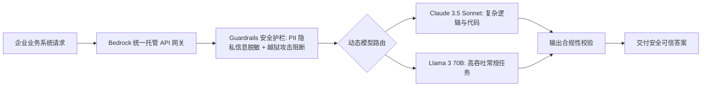

# Amazon Bedrock 企业级多模型调度与安全护栏（Guardrails）架构实战

> **主办方/公众号**：亚马逊云科技 / AWS Build On  
> **分享主题**：基于 Amazon Bedrock 构建统一大模型网关、企业级敏感词拦截与安全护栏落地  
> **核心标签**：`Amazon Bedrock` `Guardrails` `多模型统一路由` `数据隐私` `Serverless AI`

---

## 📺 课程与学习资源导航

- **📺 官方视频回放**：[Bilibili - 亚马逊云科技官方：Bedrock 企业级实战](https://space.bilibili.com/511284890)
- **💻 官方参考架构**：[AWS GenAI Solutions](https://aws.amazon.com/cn/bedrock/)

---

## 1. 企业级 Bedrock 安全网关拓扑

- **数据隐私核心承诺**：所有输入数据绝不用于底层基座模型训练，且通过 AWS PrivateLink 完全走 VPC 内网传输。
