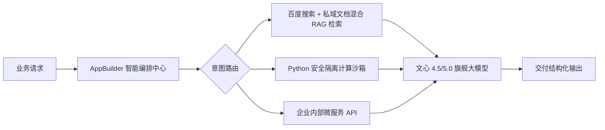

# 百度千帆大模型平台与企业 Agent 实践

> **主办方/公众号**：百度智能云 / 百度智能云千帆  
> **分享主题**：千帆 AppBuilder 组件化智能体搭建、RAG 知识库检索增强与企业工具链接入  
> **核心标签**：`百度千帆` `AppBuilder` `文心大模型` `企业 Agent` `RAG 增强`

---

## 📺 课程与学习资源导航

- **📺 官方视频回放**：[Bilibili - 百度智能云官方：千帆 AppBuilder 实战](https://space.bilibili.com/393278857) ｜ [百度智能云千帆专区](https://cloud.baidu.com/)

---

## 1. 千帆 AppBuilder 生产级 Agent 拓扑

