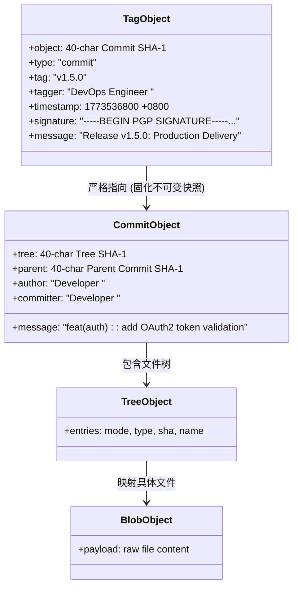
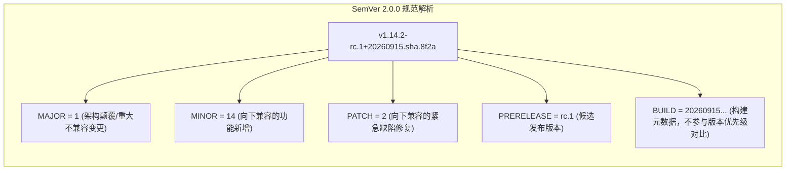
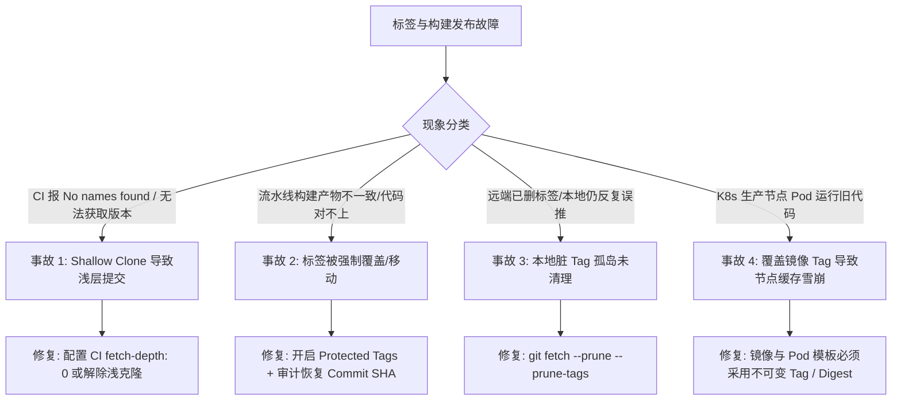

# 代码仓库标签体系与企业级版本发布深度指南

> [!NOTE]
> 本文档基于禅道 DevOps 4.x 标签管理机制进行架构提炼与升维，全面解构 Git 底层对象模型（Tag Object）、语义化版本控制（SemVer 2.0.0）、Tag-Driven 自动化流水线、容器镜像不可变性治理、软件供应链安全及生产级排障决策树。

---

## 1. 业务背景与技术定位 (Context & Core Value)

### 1.1 核心痛点与行业挑战
在传统研发运维流程中，“版本发布”往往伴随着严重的信息割裂与环境漂移：
- **版本追溯断裂**：代码提交（Commit）、测试用例、产品需求（Story）、缺陷（Bug）与线上运行的容器镜像无法形成 100% 确定性的双向映射；
- **构建不可复现（Non-reproducible Builds）**：CI/CD 构建若依赖动态分支（如 `main` 或 `release`），由于分支指针持续推进，同一分支在不同时间构建出的二进制/容器镜像实际存在代码差异；
- **镜像覆盖与缓存污染**：使用 `latest` 或静态版本覆盖推送镜像，导致 Kubernetes 节点因 `imagePullPolicy: IfNotPresent` 策略拉取到旧缓存，引发同一集群内 Pod 运行不同版本代码的“幽灵故障”；
- **供应链投毒与权限失控**：生产 Tag 缺乏数字签名认证与权限保护（Protected Tags），存在被任意开发者篡改、覆盖或删除的安全隐患。

### 1.2 架构位置与全生命周期协同
在现代企业级 DevOps 平台（如禅道 DevOps 4.x、GitLab CI/CD、GitHub Actions）中，**Git 标签（Tag）是连接“静态源码资产”与“动态运行时环境”的核心不可变锚点**：

```mermaid
flowchart LR
    A[禅道需求/缺陷池<br/>Issue & Story] -->|关联分支/Commit| B[Git 代码库<br/>GitFox / GitLab]
    B -->|版本封版/打标| C[Git Tag<br/>语义化附注标签]
    C -->|Webhook 事件触发| D[CI/CD 流水线<br/>Pipeline Orchestration]
    D -->|生成 SBOM & Cosign 签名| E[不可变制品库<br/>Harbor / Nexus]
    E -->|关联上线计划与审批| F[禅道上线计划<br/>Release Management]
    F -->|GitOps / CD 交付| G[Kubernetes 集群<br/>Prod Pods 运行实例]

    style C fill:#f96,stroke:#333,stroke-width:2px
    style E fill:#6cf,stroke:#333,stroke-width:2px
    style G fill:#9f6,stroke:#333,stroke-width:2px
```



---

## 2. 核心架构与底层原理解析 (Architecture & Deep Dive)

### 2.1 Git 引用机制与对象存储模型
Git 本质是一个**内容寻址文件系统（Content-Addressable Key-Value Store）**。所有对象存储于 `.git/objects/` 目录下，键为 40 字符的 SHA-1 哈希值（或 SHA-256），值为 zlib 压缩后的数据。

#### Git 的 4 种核心对象类型
1. **Blob**：仅存储文件纯文本或二进制数据，不含文件名与权限元数据；
2. **Tree**：对应目录，存储一组指向 Blob 或子 Tree 的条目（含模式、类型、SHA-1、文件名）；
3. **Commit**：包含指向顶层 Tree 的指针、父 Commit 指针、提交者（Committer）、作者（Author）、时间戳与提交说明；
4. **Tag Object（附注标签对象）**：独立的 Git 一级对象，专门用于版本固化。



#### 轻量标签 (Lightweight Tag) vs 附注标签 (Annotated Tag)
| 维度 | 轻量标签 (Lightweight Tag) | 附注标签 (Annotated Tag) - **生产规范推荐** |
| :--- | :--- | :--- |
| **创建命令** | `git tag v1.0.0` | `git tag -a v1.0.0 -m "Release v1.0.0"` |
| **存储位置** | `.git/refs/tags/v1.0.0` | `.git/refs/tags/v1.0.0` 且在 `.git/objects/` 生成独立对象 |
| **文件内容** | 纯文本，仅 41 字节（Commit 的 40 位 SHA-1 + 换行） | 存储 Tag Object 的 SHA-1，Tag Object 内部再指向 Commit |
| **元数据** | **无**（无法得知由谁打标、何时打标、打标原因） | **完整记录**：打标人信息、时间戳、版本说明、GPG/SSH 签名 |
| **生产适用性** | 仅限本地临时书签或实验性定位 | **生产环境 100% 强制使用**，确保合规审计与追溯性 |

验证底层数据结构：
```bash
# 1. 查看附注标签引用的对象类型与内容
git cat-file -t v1.0.0
# 输出: tag

git cat-file -p v1.0.0
# 输出示例:
# object 3b18e512db79e4c8300de4a397ec5cbd76087377
# type commit
# tag v1.0.0
# tagger SRE Lead <sre@example.com> 1773536800 +0800
# 
# Enterprise Production Release v1.0.0
```

### 2.2 供应链安全：数字签名机制 (GPG & SSH Signing)
在严苛的合规监管（如金融等保四级、ISO 27001、SLSA 等级）下，单纯的附注标签仍可能被伪造提交人（Git author 字段允许任意配置）。

#### 签名工作机制
1. **生成签名**：执行 `git tag -s v1.0.0 -m "Signed Release"` 或 `git tag -u <KEY-ID>`，Git 使用开发者的 GPG 私钥或 Ed25519 SSH 密钥对 Tag Object 元数据计算散列并加密生成摘要；
2. **校验签名**：执行 `git tag -v v1.0.0`，Git 提取公钥验证签名有效性与完整性；
3. **平台级拦截**：禅道 DevOps 4.x / GitLab 可配置“仅允许经公钥验证签名的标签触发生产上线流水线”，杜绝供应链投毒。

### 2.3 网络传输协议与 Refspec 交互
当向远端代码库推送 Tag 时，底层通过 Git Smart HTTP 或 SSH 协议执行 Refspec 协商：
- **单标签精准推送（推荐）**：
  ```bash
  git push origin refs/tags/v1.0.0:refs/tags/v1.0.0
  # 等价于: git push origin v1.0.0
  ```
- **全量标签推送（慎用）**：
  ```bash
  git push origin --tags
  ```
  > [!WARNING]
  > 生产环境严禁滥用 `git push --tags`！该命令会将本地**所有**未推送的标签（包括开发人员本地私有测试标签 `test-xxx`、`debug-1.0`）批量推送到远程服务器，污染公共仓库并可能误触发自动化流水线。

---

## 3. 生产级关键规范与配置治理 (Production Standards & Tuning)

### 3.1 语义化版本规范 (SemVer 2.0.0) 实施细则
版本格式严格遵循：`v<MAJOR>.<MINOR>.<PATCH>[-<PRERELEASE>][+<BUILD>]`



| 版本演进阶段 | 标签命名规范示例 | 触发环境 | 流水线动作 |
| :--- | :--- | :--- | :--- |
| **Alpha（内测版）** | `v2.1.0-alpha.1` | Dev / Feature 环境 | 自动化单测、代码质量扫描、推送测试镜像 |
| **Beta（公测版）** | `v2.1.0-beta.2` | QA / Test 环境 | 集成测试、自动化性能压测、漏洞扫描 |
| **Release Candidate** | `v2.1.0-rc.1` | Staging / Pre-Prod 预发 | 全链路回归、安全渗透测试、灰度引流验证 |
| **Production Release** | `v2.1.0` | Production 生产环境 | 正式封版、Cosign 镜像签名、生成 Release Notes |
| **Hotfix（紧急补丁）** | `v2.1.1` | Production 生产环境 | 基于 Release Tag 拉取 hotfix 分支修复后打标上线 |

### 3.2 标签保护规则 (Protected Tags) 与 RBAC 权限隔离
在禅道 DevOps 4.x 与现代化代码托管平台中，必须建立受保护标签规则（Protected Tag Rules）：
1. **通配符隔离**：
   - `v*.*.*`：仅允许 `Release Manager` / `SRE Maintainer` 角色创建；
   - 彻底禁止 `Developer` 或 `Reporter` 角色创建生产格式标签；
2. **禁止强制覆盖（Deny Non-fast-forward / Force Push）**：
   - 远程端绝对禁止 `git push --force origin v1.0.0`，杜绝覆盖已发布标签；
3. **删除审计与保护（Deny Tag Deletion）**：
   - 禁止在 Web 端或命令行直接删除生产标签。如需作废，应发布补丁版本（如 `v1.0.1`）或打上 `deprecated` 注解，保障审计链条不可篡改。

### 3.3 云原生制品与容器镜像不可变性契约 (Immutability)
在 Kubernetes 生产环境中，**容器镜像 Tag 必须与 Git 附注标签严格绑定，彻底消灭 `latest` 标签**：

| 维度 | 动态标签 (`latest` / `dev`) | 不可变标签 (`v1.2.3` / `v1.2.3-commitsha`) |
| :--- | :--- | :--- |
| **代码对应性** | 模糊，无法确定对应哪一次 Git Commit | 绝对确定，100% 精确映射到 Git 附注标签 |
| **K8s 节点拉取机制** | 依赖 `imagePullPolicy: Always`，频繁请求仓库导致网络抖动 | 可配置 `imagePullPolicy: IfNotPresent`，节点缓存复用，秒级调度 |
| **灾难回滚效率** | 无法通过切换 Tag 回滚，极易引发次生灾害 | `kubectl rollout undo` 或切换 YAML 镜像 Tag 即可实现秒级确定性回滚 |
| **合规与 SBOM 归属** | 无法出具不可篡改的软件物料清单（SBOM） | 可直接与 Cosign 签名、Trivy 扫描报告、禅道上线单绑定 |

---

## 4. Tag-Driven CI/CD 自动化流水线集成

### 4.1 全自动化发布流水线配置示范 (GitLab CI / 禅道流水线通用设计)
以下为标准的基于 Git Tag 事件触发的企业级构建部署流水线（包含代码检测、语义校验、多架构镜像构建与签名）：

```yaml
# .gitlab-ci.yml / 企业级 DevOps Pipeline 规范
stages:
  - pre-flight
  - build-and-scan
  - sign-and-publish
  - notify

# 阶段 1: 严格校验 Tag 命名规范
validate-tag-syntax:
  stage: pre-flight
  only:
    - tags
  script:
    - echo "Validating Git Tag against SemVer: ${CI_COMMIT_TAG}"
    - |
      if [[ ! "${CI_COMMIT_TAG}" =~ ^v[0-9]+\.[0-9]+\.[0-9]+(-[0-9A-Za-z.-]+)?$ ]]; then
        echo "❌ ERROR: Tag '${CI_COMMIT_TAG}' does not adhere to SemVer specification (e.g., v1.0.0 or v1.0.0-rc.1)"
        exit 1
      fi
    - echo "✅ Tag SemVer validation passed."

# 阶段 2: 编译与不可变容器镜像多架构构建
build-container-image:
  stage: build-and-scan
  only:
    - tags
  needs: ["validate-tag-syntax"]
  image: docker:24.0.5
  services:
    - docker:24.0.5-dind
  script:
    - docker login -u "${REGISTRY_USER}" -p "${REGISTRY_PASSWORD}" "${REGISTRY_URL}"
    # 使用 Buildx 跨架构构建并同时打上 Tag 标签与 Commit SHA 备用标签
    - docker buildx create --use
    - |
      docker buildx build \
        --platform linux/amd64,linux/arm64 \
        --build-arg BUILD_TIME="$(date -u +'%Y-%m-%dT%H:%M:%SZ')" \
        --build-arg GIT_COMMIT="${CI_COMMIT_SHA}" \
        --build-arg GIT_TAG="${CI_COMMIT_TAG}" \
        -t "${REGISTRY_URL}/microservices/app:${CI_COMMIT_TAG}" \
        -t "${REGISTRY_URL}/microservices/app:${CI_COMMIT_SHORT_SHA}" \
        --push .

# 阶段 3: 供应链安全加固 - Cosign 签名与 SBOM 导出
sign-artifact:
  stage: sign-and-publish
  only:
    - tags
  needs: ["build-container-image"]
  image: bitnami/cosign:latest
  script:
    - echo "Signing container image with Cosign..."
    - cosign sign --key "${COSIGN_PRIVATE_KEY}" -y "${REGISTRY_URL}/microservices/app:${CI_COMMIT_TAG}"
    - echo "✅ Container Image Cryptographically Signed."

# 阶段 4: 自动更新禅道上线计划与状态回写
update-zentao-release:
  stage: notify
  only:
    - tags
  script:
    - |
      curl -X POST "https://zentao.example.com/api.php/v1/releases" \
        -H "Token: ${ZENTAO_API_TOKEN}" \
        -H "Content-Type: application/json" \
        -d '{
          "name": "'"${CI_COMMIT_TAG}"'",
          "build": "'"${CI_COMMIT_SHORT_SHA}"'",
          "desc": "Automated pipeline generated release for '"${CI_COMMIT_TAG}"'"
        }'
```

---

## 5. 生产高频踩坑与排障决策矩阵 (Troubleshooting Matrix)



### 5.1 事故 1：CI/CD 流水线因 Shallow Clone 导致 `git describe --tags` 失败
- **故障现象**：
  在 Jenkins / GitLab CI / GitHub Actions 中执行命令自动提取版本时报错：
  ```bash
  $ git describe --tags
  fatal: No names found, cannot describe anything.
  ```
- **深层根因**：
  现代 CI/CD Runner 为优化克隆速度，默认配置了浅克隆（Shallow Clone，如 `git clone --depth 1` 或 `GIT_DEPTH: 20`）。若最新的 Tag 所在 Commit 距离当前分支尖端超过了克隆深度，或者浅克隆根本没有拉取 `.git/refs/tags`，Git 拓扑中找不到任何 Tag 对象，导致元数据获取为空，构建出的镜像版本变成 `v0.0.0-unknown`。
- **排查命令**：
  ```bash
  # 检查当前克隆是否为浅层仓库 (true 表示浅克隆)
  git rev-parse --is-shallow-repository
  ```
- **标准化修复方案**：
  在 CI 配置中解除浅克隆限制，或在构建前显式拉取完整 Tag 引用：
  ```yaml
  # GitHub Actions 解决方案
  - uses: actions/checkout@v4
    with:
      fetch-depth: 0  # 0 代表拉取全部历史提交与标签

  # GitLab CI 解决方案
  variables:
    GIT_DEPTH: "0"

  # Shell 脚本补救命令
  script:
    - git fetch --unshallow || git fetch --tags
  ```

---

### 5.2 事故 2：开发人员强制移动/覆盖 Tag 导致构建不可复现与缓存错乱
- **故障现象**：
  测试环境原本验收通过的 `v1.2.0`，在两小时后生产上线时打包出来的产物功能缺失，且无法对齐原有测试报告；研发团队互相指责代码被回滚。
- **深层根因**：
  某开发人员发现 `v1.2.0` 遗漏了一个修改，直接在本地修复后执行了：
  ```bash
  git tag -f v1.2.0
  git push --force origin v1.2.0
  ```
  远端代码库未开启受保护标签拦截（Protected Tags），原有的 Tag 指针被强制重定向至新的 Commit。下游流水线使用该 Tag 重复构建，破坏了“版本不可变性（Immutability）”核心原则。
- **排查命令**：
  ```bash
  # 查看远端和本地 reflog 确定该 Tag 历史指向的真实 Commit SHA
  git log -g --abbrev-commit refs/tags/v1.2.0
  ```
- **修复方案与长效防护**：
  1. **平台侧**：在禅道/GitLab 代码库设置中，将 `v*` 设为 `Protected Tag`，且关闭所有角色的 Force Push 权限；
  2. **工程侧**：建立铁律——**已经发布的 Tag 绝对不允许二次移动**。若发现缺陷，必须发布修复补丁版本 `v1.2.1`。

---

### 5.3 事故 3：本地存在残留脏 Tag 导致与远端不一致（Tag 孤岛）
- **故障现象**：
  管理员在远端代码库通过 Web 页面删除了废弃的标签 `v2.0.0-bad`，但团队内其他成员在本地执行常规 `git fetch` 或 `git pull` 后，本地仓库依然存在该标签，并在后续执行 `git push --tags` 时将该废弃标签重新推送到远端服务器。
- **深层根因**：
  默认的 `git fetch`（甚至包含 `git fetch --prune`）默认只负责清理远端已经删除的**分支（Branches）**，**不会**自动清理本地已删除的标签（Tags）。这是 Git 设计上的保守策略，旨在防止远程操作无意中删除开发者本地的私有标签。
- **排查命令**：
  ```bash
  # 对比本地标签与远程标签的差异
  diff <(git tag | sort) <(git ls-remote --tags origin | awk -F'/' '{print $3}' | grep -v '\^{}' | sort)
  ```
- **修复方案**：
  强制同步清理本地不存在于远程的废弃标签：
  ```bash
  # 单次同步清理远端已被删除的本地孤岛标签
  git fetch --prune --prune-tags

  # 全局持久化配置 (推荐在所有工程师机器及 CI Runner 执行)
  git config --global fetch.prune true
  git config --global fetch.pruneTags true
  ```

---

### 5.4 事故 4：容器镜像覆写 Tag 诱发 K8s 节点 `IfNotPresent` 缓存雪崩
- **故障现象**：
  发布上线后，Kubernetes 集群内多副本应用（Deployment replicas=4）表现异常：Node-A 上的 Pod-1 正常显示新功能，而 Node-B 上的 Pod-2 依旧显示老旧界面；日志排查发现同一版本号在不同 Pod 行为不一致。
- **深层根因**：
  构建脚本覆盖了镜像的 Tag（例如仍使用 `v1.0.0`），而 Kubernetes 的 Pod spec 配置了：
  ```yaml
  image: harbor.example.com/app/frontend:v1.0.0
  imagePullPolicy: IfNotPresent
  ```
  - Node-A 此前从未运行过该应用，执行调度时从 Harbor 拉取了最新的镜像；
  - Node-B 本地容器运行时（containerd / crictl）已经缓存了旧版 `v1.0.0` 的镜像层，判定为 `Present` 直接复用旧镜像启动容器，导致节点间版本漂移。
- **修复方案**：
  1. **镜像不可变强制契约**：Harbor 制品库配置 **Tag Retention & Immutability Rule**，直接锁定 `v*` 格式标签禁止覆盖；
  2. **生产环境 Spec 标准化**：
     - 若必须采用可变 Tag，强制配置 `imagePullPolicy: Always`；
     - **生产终极方案**：生产环境部署清单由 GitOps / ArgoCD 自动将 Tag 转化为唯一确定的 **SHA256 镜像摘要（Digest）**：
       ```yaml
       # 生产零漂移标准配置
       image: harbor.example.com/app/frontend:v1.0.0@sha256:7f83b1657ff1fc53b92dc18148a1d65ddc0a3e0...
       ```

---

## 6. 架构总结与思维导图 (Summary)

```
                       企业级代码仓库标签与版本发布体系
                                      │
          ┌───────────────────────────┼───────────────────────────┐
          │                           │                           │
   【Git 底层对象模型】       【规范契约与生命周期】       【DevOps 自动化与安全】
   ├─ .git/refs/tags/          ├─ SemVer 2.0.0 规范         ├─ Tag-Driven CI/CD
   ├─ Lightweight (Commit 指针)├─ Protected Tags 权限治理  ├─ Cosign 镜像签名
   ├─ Annotated (独立对象)     ├─ 制品与镜像不可变性        ├─ 禅道上线计划闭环
   └─ GPG / Ed25519 数字签名   └─ 废弃打标与补丁演进        └─ 规避 Shallow Clone/缓存陷阱
```

- **核心原则一**：生产发布 100% 强制使用**附注标签（Annotated Tag）**并配合 GPG/SSH 签名，严禁使用信息缺失的轻量标签；
- **核心原则二**：严格遵循 **SemVer 2.0.0** 命名，生产标签必须受平台级权限保护（Protected Tags），禁止覆盖与直接删除；
- **核心原则三**：容器镜像与 Git Tag 强绑定，并在制品库（Harbor）端开启 **Tag Immutability（不可变性规则）**，杜绝集群节点本地镜像缓存雪崩。

---

> [!TIP] 💡 关联技术与延伸阅读
>
> * [Linux 内核与系统参数优化](../../02-Linux/README.md)
> * [Kubernetes 容器运行时 CRI 与调度控制面](../../03-K8S/01-组件原理/README.md)
> * [生产级云原生与基础架构全栈知识库全局规范](../../../GEMINI.md)
> * [全栈工程师面试提炼与核心卡片](../../../02_Notes/README.md)
