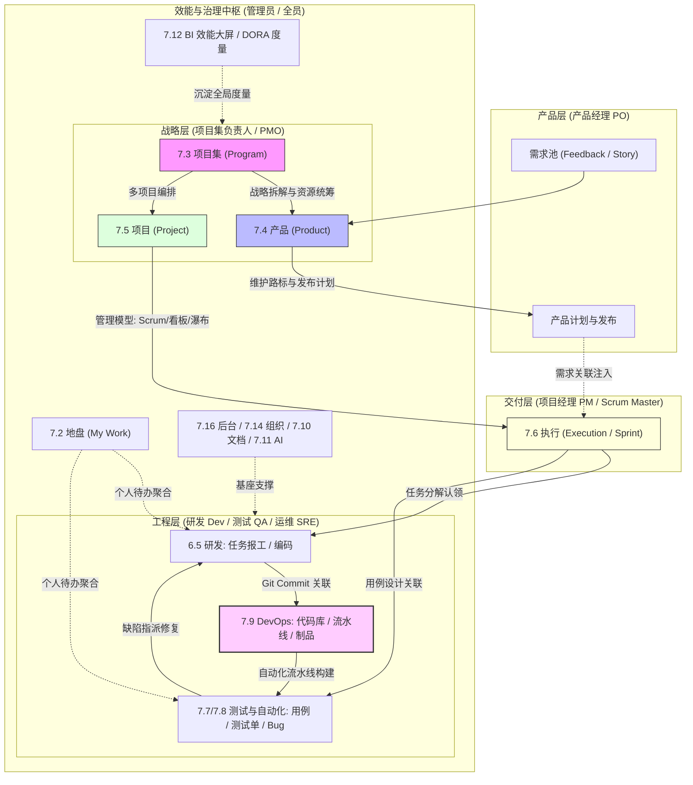
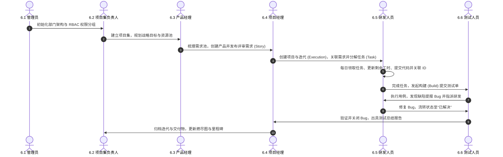
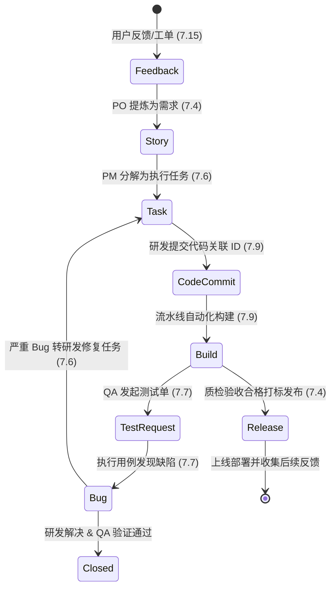
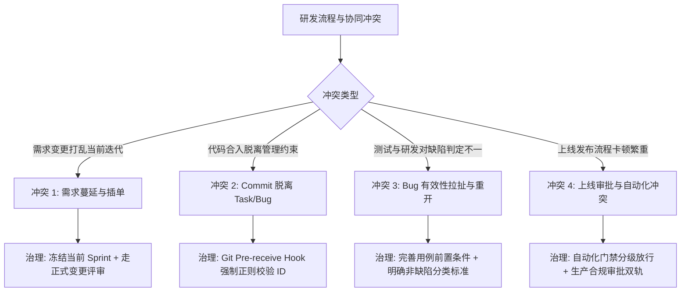

# 禅道项目管理与 DevOps 全景指南：角色协同与功能架构深度实践

> [!NOTE]
> 本文档基于禅道官方手册核心架构体系，重点围绕**“第 6 章 按照角色使用”**与**“第 7 章 功能介绍”**进行全面解构与架构升维。系统梳理 6 大核心角色协同链路、16 大功能模块数据闭环，并融合云原生交付、DORA 研发效能度量与典型生产冲突排障决策树。

---

## 1. 业务背景与体系定位 (Context & Core Value)

### 1.1 企业研发协同的结构性困局
在数字化转型与敏捷工程落地过程中，研发团队普遍面临三大核心割裂：
- **组织角色与权责割裂**：业务/PO 关注需求交付节奏，研发关注技术实现与代码质量，测试面临手工用例滞后，SRE 疲于被动救火，各角色缺乏全链路透明的数据底座；
- **管理结构与交付流转断层**：企业战略（高管层）无法向下拆解到产品与项目，迭代执行（Sprint）过程中的工时与代码提交脱节，无法准确评估交付成本与延期风险；
- **工具链孤岛与可追溯性丢失**：需求管理系统与底层 Git 代码库、CI/CD 构建流水线、制品库（Harbor）互为孤岛，导致发布版本无法 100% 倒查需求与缺陷根因。

### 1.2 禅道全景流转与全生命周期协同拓扑
禅道通过“四层管理结构”将研发流程各角色与功能模块贯穿为不可分割的闭环：



---

## 2. 按照角色使用：企业级六维协同深度实战 (Chapter 6)

遵循官方手册第 6 章体系，解构各角色的职责边界、高频关键动作、输入输出规范及协同卡点。



### 2.1 6.1 管理员 (System Administrator)
- **定位**：系统安全底座与组织流程的顶层设计者。
- **核心输入**：企业组织架构清单、公司安全合规策略、外部第三方协同系统对接需求。
- **核心操作规程**：
  1. **组织与权限治理**：配置部门树结构，维护用户花名册；建立基于最小特权原则（PoLP）的权限分组，严格隔离“系统管理、项目集审批、源码读写、生产发布”权限；
  2. **企业级集成**：配置 LDAP / Active Directory / OAuth2 单点登录（SSO）；打通企业微信、钉钉、飞书 Webhook 机器人及邮件发信服务；
  3. **数据安全与运维基线**：配置自动化定时备份策略（数据库 + 附件目录）、数据表引擎优化、安全策略（密码复杂度、防暴力破解锁定）。
- **关键输出**：稳定的组织人员权限体系、高可用系统运行环境、审计日志。

---

### 2.2 6.2 项目集负责人 (Program Manager / PMO)
- **定位**：企业级战略统筹与多项目资源协同的航标掌控者。
- **核心输入**：公司战略 OKR/KPI、年度研发预算、跨部门交付路标。
- **核心操作规程**：
  1. **战略拆解与项目建立**：创建顶层项目集（Program），根据业务线拆分子项目集；
  2. **多项目资源平衡**：统筹各项目的人力、预算与时间跨度，通过“项目集看板”实时把控各子项目的执行偏差；
  3. **全局风险与依赖管理**：协调跨项目间的技术组件依赖（如公共中间件依赖），干预进度严重滞后的高风险项目。
- **关键输出**：项目集健康度视图、资源负荷平衡报告、战略落地里程碑报表。

---

### 2.3 6.3 产品经理 (Product Manager / PO)
- **定位**：“做正确的事”——产品商业价值与需求全生命周期的拥有者。
- **核心输入**：市场调研报告、用户反馈（Feedback）、业务方原始诉求、工单系统沉淀。
- **核心操作规程**：
  1. **需求池与分级流转**：从反馈与工单池中提炼原始需求，将其结构化拆解为“业务需求 -> 用户需求 -> 软件需求（Story）”；
  2. **需求评审与基线管理**：组织架构师、开发与测试召开需求评审会，明确验收标准（Acceptance Criteria / INVEST 原则），通过后锁定需求基线；
  3. **路线图与版本规划**：制定产品长期路线图（Roadmap），划定具体产品计划（Plan）与版本发布目标（Release）；
  4. **产品验收**：在迭代末期依据验收条件对交付功能进行终审，决定功能是否合规上线。
- **关键输出**：评审通过的用户故事（User Story）、产品发布计划、版本 Release Notes。

---

### 2.4 6.4 项目经理 (Project Manager / Scrum Master)
- **定位**：“正确且高效地做事”——交付过程与团队敏捷工程的推进者。
- **核心输入**：已评审的产品需求、团队成员生产力可用工时、交付截止日期。
- **核心操作规程**：
  1. **立项与流程模型适配**：创建项目（Project），按业务属性适配管理模型（互联网应用选 Scrum、运维支持选 Kanban、硬件或嵌入式选 瀑布/IPD、复合适配选 融合敏捷）；
  2. **迭代规划（Execution）**：创建具体的迭代执行周期（通常 2~3 周），关联产品需求并组织迭代计划会，协助研发拆解任务（Task）；
  3. **过程监控与敏捷度量**：主持每日站会（Daily Standup），监控迭代燃尽图（Burndown Chart）斜率；排查工时异常，管理项目风险（Risk）与问题（Issue）；
  4. **版本发布与过程回溯**：组织迭代演示会（Demo）与回顾会（Retrospective），审计项目交付物，沉淀过程资产。
- **关键输出**：迭代执行看板、燃尽图走势、项目风险登记册、周报/交付物报告。

---

### 2.5 6.5 研发人员 (Developer / Tech Lead)
- **定位**：“交付高质量的代码与构建”——技术方案设计与代码落地的实干者。
- **核心输入**：已分解的任务清单（Task）、待修复的缺陷（Bug）、架构设计规范。
- **核心操作规程**：
  1. **任务认领与精确报工**：从迭代待办池中认领任务，按日填报“消耗工时”并动态调整“预计剩余工时”（剩余工时直接驱动燃尽图真实走势）；
  2. **代码提交强关联规范**：本地拉取 feature 分支，在 Git Commit 消息中遵循格式规范（如 `feat(auth): add OAuth2 check, refs #1234`），系统自动将代码提交与禅道 Task/Bug 双向锚定；
  3. **代码评审与自动化构建**：发起合并请求（MR），配合评审人完成 Code Review；触发 CI 构建产生可部署物料（Build）；
  4. **Bug 确认与闭环**：收到测试指派的 Bug 时，快速在本地复现、定级与修复，将 Bug 状态变更为“已解决”并备注根本原因（代码错误、设计缺陷、配置问题等）。
- **关键输出**：高质量业务代码、关联任务/Bug 的 Git 提交、编译构建产物（Build）、缺陷修复说明。

---

### 2.6 6.6 测试人员 (QA / Test Lead)
- **定位**：“为质量门禁负责”——软件质量与发布准入把关人。
- **核心输入**：产品需求验收准则、研发提交的构建版本（Build）、设计用例场景。
- **核心操作规程**：
  1. **用例设计与用例库管理**：依据需求文档撰写功能、性能、安全测试用例（Case）与用例场景（Scene），沉淀至企业公共用例库；
  2. **测试单（Test Request）流转**：研发创建 Build 并提交测试申请后，QA 建立关联测试单并分配测试任务；
  3. **用例执行与 Bug 提报**：执行手工或自动化用例（ZTF/自动化框架）；遇到非预期结果即刻提报 Bug，严格填报重现步骤、运行环境与日志截图，并指派给对应开发；
  4. **缺陷复测与测试报告**：对开发解决的 Bug 进行严格回归复测，符合要求则“关闭（Close）”，否则“激活（Reopen）”；迭代结束后自动生成《测试总结报告》。
- **关键输出**：测试用例库、缺陷跟踪看板、测试总结报告、发布质量验收意见。

---

## 3. 功能介绍：16 大功能模块架构解构 (Chapter 7)

遵循官方手册第 7 章体系，对 16 个功能模块的设计思想、数据关系与功能边界进行全景梳理。

| 章节编号 | 模块名称 | 核心设计理念 | 核心功能点与支撑实体 | 关键数据关联 |
| :--- | :--- | :--- | :--- | :--- |
| **7.1** | **核心管理结构** | 战略到执行的四层递进 | 项目集 (Program) -> 产品 (Product) -> 项目 (Project) -> 执行 (Execution) | 决定整个系统的顶层数据树形继承关系 |
| **7.2** | **地盘** | 个人高效工作台 | 我的待办、我的需求/任务/Bug、工作日志（Effort）、审批流、组织动态 | 聚合全系统所有指派给“当前登录用户”的待办实体 |
| **7.3** | **项目集** | 多项目与战略投资管理 | 子项目集、项目集看板、资源统筹、战略目标分解、项目集层级报表 | 挂载多个产品与项目，提供跨域度量视图 |
| **7.4** | **产品** | 价值输入与规划中枢 | 需求池、产品模块、多分支/平台、产品计划、版本发布、路线图 (Roadmap) | 承载业务/软件需求，向下投递至项目执行 |
| **7.5** | **项目** | 战略落地的履约载体 | 9 大管理模型选择、立项审批、团队配置、质量保证、过程基线、风险/问题 | 将产品需求转换为具体的工程交付契约 |
| **7.6** | **执行** | 敏捷落地的工作单元 | 迭代 (Sprint) 规划、任务分解、工时预估与填报、燃尽图、执行甘特图 | 包含 Task 实体，驱动每日站会与研发交付 |
| **7.7** | **测试** | 质量门禁与缺陷闭环 | 测试用例、用例套件、用例评审、测试单、测试报告、Bug 全生命周期管理 | 关联 Build、Story 与 Task，形成质量网状追踪 |
| **7.8** | **自动化测试** | 研发效能提速引擎 | ZTF 框架集成、测试脚本执行、自动化测试用例导入、测试结果一键回写 | 将代码工程级单元/接口自动化与禅道用例打通 |
| **7.9** | **DevOps (解决方案)** | 源码到制品的流水线中枢 | 代码库 (GitFox/GitLab/Gitea)、流水线编排、制品库 (Harbor)、应用与环境 | 承接研发 Commit，触发 CI/CD 并产生不可变构建 |
| **7.10** | **文档** | 组织数字资产沉淀中枢 | 我的空间、团队空间、产品空间、项目空间、接口空间（API 维护）、模板库 | 为各层级实体提供结构化 Markdown / 富文本知识沉淀 |
| **7.11** | **AI** | 智能化效能助手 | 禅道智能体、数字员工、企业专属知识库 RAG、AI 辅助写用例/拆任务、CLI | 通过 LLM / Agent 降低研发与管理人员重复录入成本 |
| **7.12** | **BI** | 数据驱动的管理驾驶舱 | 自定义大屏设计器、透视表下钻、多维度度量项编码、DORA 效能指标监控 | 聚合工时、缺陷、交付周期数据，呈现客观效能指标 |
| **7.13** | **看板** | 敏捷流动的可视化呈现 | 通用看板、泳道划分、WIP（在制品限制）、卡片流转、看板统计分析 | 覆盖任务、需求、Bug、项目集等多维度可视化 |
| **7.14** | **组织** | 组织治理与人员基座 | 公司信息、部门树、用户花名册、权限分组 (RBAC)、联系人名单 | 全系统的身份认证（AuthN）与授权（AuthZ）源头 |
| **7.15** | **反馈** | 外部声音的双向交互 | 用户反馈入口、工单系统 (Ticket)、FAQ 知识库、反馈转需求/Bug/任务 | 连接终端用户与内部研发，完成需求闭环 |
| **7.16** | **后台设置** | 系统运维与底座配置 | 模式切换、数据定时备份、回收站、系统安全策略、LDAP/SSO、通知发信 | 支撑整套禅道软件的私有化底座健康运行 |

---

## 4. 深度思考与架构优化：现代 DevOps 落地实践 (Deep Optimization)

结合企业级云原生体系与生产实际，对禅道理念进行架构级优化与实战升维。

### 4.1 核心概念全生命周期流转状态机 (The 8-Concept Closed Loop)
禅道宣称的 8 大核心概念并非割裂存在，而是具备严格的前后依赖与状态机约束：



### 4.2 研发效能度量模型与 DORA 四大指标映射
传统敏捷常陷入“唯工时论”或“代码行数陷阱”。在现代平台工程体系下，应利用禅道 **7.12 BI 模块** 结合 **7.9 DevOps 流水线** 构建行业标准的 **DORA（DevOps Research and Assessment）四大核心度量指标**：

| DORA 核心指标 | 业务度量意义 | 禅道底层数据采集源与计算公式 | 卓越标准 (Elite) |
| :--- | :--- | :--- | :--- |
| **变更提前期 (Lead Time for Changes)** | 从代码 Commit 到最终在生产环境运行的时长 | `上线发布时间 (Release.date)` - `首次 Commit 时间` | < 1 天 |
| **部署频率 (Deployment Frequency)** | 团队向生产环境部署代码的频次 | 统计周期内 `DevOps 上线计划成功执行次数 / 天数` | 按需每天多次 |
| **变更失败率 (Change Failure Rate)** | 生产发布后导致故障或回滚的比例 | `生产紧急 Hotfix Bug 数量 / 生产总发布次数 * 100%` | 0% ~ 15% |
| **服务恢复时间 (MTTR)** | 生产故障从发生到修复恢复的时长 | `生产故障级 Bug (Severity 1) 的解决关闭时间` - `提报时间` | < 1 小时 |

---

## 5. 角色协同高频冲突与生产排障决策矩阵 (Troubleshooting Matrix)

在敏捷与 DevOps 实施过程中，由于流程变形或工具断层，团队常陷入以下高频故障与拉扯。



### 5.1 冲突 1：迭代中途频繁“插单”导致团队交付失控 (Scope Creep)
- **现象**：
  迭代开发到第 5 天，业务方/PO 临时插入 3 个“极度紧急”的需求，导致原定迭代任务全部延期，燃尽图出现大幅陡峭上升，研发怨声载道。
- **根因**：
  需求流转没有遵循“迭代保护期”原则，PO 绕过需求评审直接在活跃的“执行（Execution）”中强制挂载需求。
- **标准化治理方案**：
  1. **原则约束**：当前正在执行的 Sprint 范围原则上锁定，任何新需求只能录入“需求池”，排入下一迭代；
  2. **紧急熔断机制**：若业务严重阻断必须插单，严格执行“等量置换原则”——新增 20 工时需求，必须由 PO 协商从当前迭代移出 20 工时的既有需求，保持团队负载平衡；并在禅道中记录“变更（Change）”以备复盘。

---

### 5.2 冲突 2：开发人员提交代码未关联任务/Bug 导致发布追溯黑盒
- **现象**：
  生产版本出现严重故障，通过 Git 翻查上线分支的 Commit 记录，充斥着大量的 `fix bug`、`update code`、`temp commit`，无法定位改动属于哪个禅道需求，也无法追溯经由哪位 QA 验收。
- **根因**：
  研发自由提交代码，Git 仓库未在服务器端建立校验钩子（Server-side Hook）。
- **标准化治理方案**：
  在代码仓库（GitFox / GitLab / Gitea）的服务端部署 `pre-receive` 钩子，强制正则校验 Commit Message：
  ```bash
  #!/usr/bin/env bash
  # pre-receive hook: 强制提交注释包含禅道 Task 或 Bug ID
  regex="^\[(task|bug|story):#[0-9]+\] .+"
  while read oldrev newrev refname; do
      for commit in $(git rev-list $oldrev..$newrev); do
          msg=$(git log -1 --format=%B $commit)
          if ! [[ $msg =~ $regex ]]; then
              echo "❌ 提交拒绝: Commit 消息必须包含禅道关联标记！"
              echo "   正确示例: [task:#1234] feat(user): add login verification"
              echo "   正确示例: [bug:#5678] fix(order): handle null pointer"
              exit 1
          fi
      done
  done
  exit 0
  ```

---

### 5.3 冲突 3：研发与测试在 Bug 判定上的拉扯（“这不是 Bug”与反复激活）
- **现象**：
  测试提报 Bug，开发以“原本就是这样设计的 / 需求没写清 / 环境问题”为由直接拒绝（Resolution: Not a Bug）；测试不认可并再次激活（Reopen），形成沟通内耗。
- **根因**：
  需求缺乏清晰的验收条件（AC），测试提报 Bug 时未提供详尽的前置步骤和环境上下文，且缺少“缺陷仲裁人”。
- **标准化治理方案**：
  1. **提报质量底线**：测试提报 Bug 必须包含“前置条件、操作步骤、实际结果、预期结果（对照需求 AC 编号）及错误日志截图”；
  2. **仲裁机制**：研发若认定非 Bug，禁止直接关闭，状态流转给 **PO（产品经理）** 进行仲裁。PO 判定属于设计欠缺则转为“需求优化”，判定属于实现偏差则责令研发修复。

---

### 5.4 冲突 4：自动化流水线高速交付与上线审批安全合规的冲突
- **现象**：
  DevOps 团队搭建了敏捷 CI/CD 流水线，但每次上线仍需手工填写大量纸质或线下审批单，导致“构建只要 5 分钟，审批耗费 2 天”，流水线效能大打折扣。
- **根因**：
  上线审批与 DevOps 工具链断裂，缺乏自动化质量门禁（Quality Gates）机制。
- **标准化治理方案**：
  1. **环境分级策略**：Dev、QA、Pre-Prod 预发环境彻底放开自动化部署，无需人工审批；
  2. **生产环境流水线挂载审批节点**：在禅道 **7.9 DevOps** 的上线计划中配置 Webhook，流水线自动聚合“代码门禁（SonarQube 通过）、用例通过率（100%）、Cosign 镜像签名合规”，形成自动化体检报告推送给变更委员会（CAB），审批人一键在线签署放行，兼顾敏捷与等保合规。

---

## 6. 架构总结与思维导图 (Summary)

```
                     现代企业级研发项目管理与 DevOps 架构全景
                                       │
          ┌────────────────────────────┼────────────────────────────┐
          │                            │                            │
   【6 大核心角色使用】          【16 大功能模块流转】        【现代效能与治理落地】
   ├─ 6.1 管理员 (安全与底座)   ├─ 7.1 核心管理结构 (4层)   ├─ 八大概念闭环状态机
   ├─ 6.2 项目集负责人 (战略)   ├─ 7.2 地盘 (工作台)        ├─ DORA 四大效能度量
   ├─ 6.3 产品经理 (需求价值)   ├─ 7.3~7.6 规划与执行       ├─ Git Commit 强关联拦截
   ├─ 6.4 项目经理 (交付推进)   ├─ 7.7~7.8 质量与自动化     ├─ 敏捷插单熔断与置换机制
   ├─ 6.5 研发人员 (任务与代码) ├─ 7.9 DevOps (代码/流水线) ├─ 缺陷仲裁与提报规范
   └─ 6.6 测试人员 (质量门禁)   └─ 7.10~7.16 资产与配置     └─ 自动化分级上线审批
```

- **核心结论一**：角色使用的核心在于**确立边界与减少断层**。PO 聚焦需求价值，PM 聚焦执行节拍，Dev 与 QA 围绕构建物料高频验证，SRE 夯实流水线与不可变基座；
- **核心结论二**：16 大功能模块必须服务于“全链路可追溯性”。通过 Git 提交、构建流水线与缺陷单的双向锚定，消灭信息孤岛；
- **核心结论三**：效能提升必须依赖客观指标（DORA / 价值流图 VSM），借助平台自动化能力破除组织内耗，实现高质量持续交付。

---

> [!TIP] 💡 关联技术与延伸阅读
>
> * [代码仓库标签体系与企业级版本发布深度指南](../01-代码仓库与版本治理/01-代码仓库标签体系与企业级版本发布深度指南.md)
> * [DevOps 模块全局目录索引](../README.md)
> * [Kubernetes 容器编排与集群运维](../../03-K8S/README.md)
> * [企业级云原生与基础架构全栈知识库全局规范](../../../GEMINI.md)
