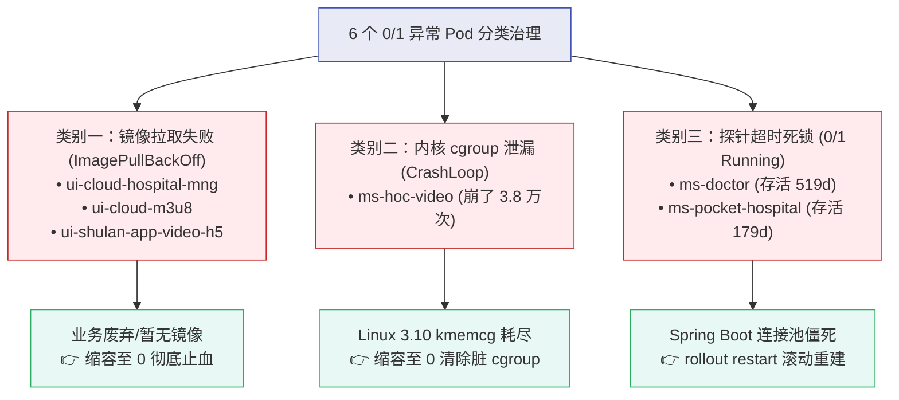

# 2026-09-20 日常工作处理总结 (全链路生产攻坚、AI Agent 架构与全场景排障沉淀)

---

> [!NOTE] 📋 日志元信息
> - **记录日期**：2026-09-20
> - **所属模块**：`02_Notes/` 日常工作处理总结
> - **涉及环境**：生产与测试 Kubernetes 集群（`platform-pro`、`platform-test`、`pro` 命名空间）、CentOS Linux 7 (3.10.0 内核)、MySQL 5.7/8.0 (`mysql-his-mdsn01`)
> - **涉及核心组件**：MongoDB 4.x、RocketMQ Dashboard、Spring Boot 微服务群（`ms-pub`, `ms-doctor`, `ms-pocket-hospital`, `ms-hoc-video`）、Seata 分布式事务 (`emr.undo_log`)、Prometheus 告警体系、AI Agent 架构

---

## 🎯 一、今日核心工作概览

今日是全天候、高强度的企业级云原生与基础架构全栈攻坚日，涵盖了从底座存储、微服务探针、容器内核资源治理、JVM 调优到数据库分布式事务死锁及 AI 智能体体系化梳理：

1. **MongoDB 宕机 78 天重大故障彻底修复**：定位宿主机孤儿进程 PID 1023 持锁根因，优雅释锁，MongoDB Pod 顺利恢复正常 `Running`。
2. **生产安全红线规范制度化确立**：制定并落盘“生产环境资产未清严禁写操作”红线，确立“全只读取证先行，一次性提供检查脚本”的排查标准规程。
3. **生产环境 6 个 0/1 Pod 分类攻坚歼灭战**：
   - 3 个前端 UI Pod 缩容至 0 止血；
   - `ms-hoc-video` 崩溃 3.8 万次内核 cgroup 泄漏深度定性与处置；
   - `ms-doctor` 运行 519 天 0/1 探针死锁彻底破局，恢复至健康 `1/1 Running`。
4. **PromQL 生产级指标缺失陷阱与黄金告警规则验证**：通过生产实测印证 `<none>` 缺失陷阱，确立基于 `unless` 的零漏报标准规则。
5. **AI Agent（智能体）体系化深度解析**：系统拆解 Brain（推理/ReAct）、Planning（子任务分解/自我反思）、Memory（短期工作内存与长期记忆）、Tools（MCP协议/工具接地）四大支柱与 SRE 智能体演进。
6. **RocketMQ Dashboard 内存异常暴涨（14GB）根治**：定位 JDK 8u111 容器内存盲区及 K8s 资源未限制缺陷，双环境注入 JVM 参数与 Limits 熔断，物理内存收敛超 26GB。
7. **微服务 `ms-pub` 频繁重启 3,818 次坏节点（Dead Node）定位**：通过 Describe 与 Previous 日志破译 HikariCP 初始化超时死因，精准定性 `kube-node06` 容器出网 SNAT/网络异常。
8. **MySQL HIS 核心库高频死锁（24次/分）RCA 根因排查**：捕获 `SHOW ENGINE INNODB STATUS`，破译 Seata 分布式事务 `undo_log` 表一阶段 INSERT 与二阶段 SELECT FOR UPDATE 冲突根因，定位业务调用链路。

---

## 🛠️ 二、MongoDB 宕机 78 天（重启 54,463 次）深度排障与恢复

### 1. 故障现象
- 命名空间 `pro` 下的 `mongodb-bfbd4cd6b-7vdpj` 持续处于 `CrashLoopBackOff`，累计重启 **54,463 次**，持续宕机达 **78 天**。
- 容器启动报错日志：
  ```text
  WiredTiger error (-31802): ... /bitnami/mongodb/data/db/mongod.lock: Resource temporarily unavailable
  Failed to open lock file: /bitnami/mongodb/data/db/mongod.lock
  ```

### 2. RCA 根因深度剖析
- 严格执行**全只读取证**，在宿主机 `kube-node03` 上通过 `fuser` 和 `ps -ef | grep mongod` 摸排底层资产：
  - 发现宿主机常驻进程 `mongod`（PID: 1023），父进程为 `1`（systemd 孤儿进程），且其启动时间恰好是 78 天前。
  - 该进程为历史遗留的僵死容器未被 Docker 彻底杀死的孤儿进程，持续占用宿主机存储卷上的锁文件 `mongod.lock`，导致 Kubernetes 调度拉起的新容器每次启动均因拿不到文件排他锁而崩溃退出。

### 3. 安全处置与恢复
- **操作执行**：严禁直接暴力 `rm -f mongod.lock`（会破坏数据一致性）。在确认 PID 1023 无活跃业务写入后，执行优雅终止信号：
  ```bash
  kill -15 1023
  ```
- **恢复效果**：孤儿进程退出并自动释放底层文件锁，Kubernetes 控制器拉起新容器，MongoDB Pod 顺利通过启动自检，恢复为健康的 **`Running`** 状态，对外提供 27017 服务。

---

## 🔍 三、生产 6 个 0/1 Pod 分类攻坚歼灭战

在基础底座 MongoDB 恢复后，排查 `pro` 命名空间剩余的 6 个异常 Pod，呈现三种典型故障模式并逐一破局：



### 1. 类别一：前端 UI 服务镜像拉取失败治理
- **对象**：`ui-cloud-hospital-mng`、`ui-cloud-m3u8`、`ui-shulan-app-video-h5`
- **现象**：`ImagePullBackOff` 持续 176d~179d，内网私有镜像仓库历史 TAG 被清理或鉴权凭证失效。
- **处置**：执行快速缩容至 `0`，消除无意义的重复拉取报警与事件堆叠：
  ```bash
  kubectl -n pro scale deployment ui-cloud-hospital-mng ui-cloud-m3u8 ui-shulan-app-video-h5 --replicas=0
  ```
- **附带排坑**：终端输入 `--replica` 按 Tab 出现 `-bash: _get_comp_words_by_ref: command not found`，定位为缺少 `bash-completion`，通过 `yum install -y bash-completion && source /usr/share/bash-completion/bash_completion` 修复。

### 2. 类别二：`ms-hoc-video` 崩溃 3.8 万次与 Linux 3.10 内核 cgroup 泄漏定性
- **现象**：重启次数高达 **38,043 次**，运行时间 **2 年 95 天**。启动报错：`unable to apply cgroup configuration: mkdir ...: cannot allocate memory: unknown (exitCode: 128)`。
- **深入只读取证**：宿主机 `kube-node01`（CentOS 7, 内核 `3.10.0-1160.95.1.el7.x86_64`）。Pod 自身仅占 1.2MB 内存，配额为 2Gi。
- **RCA 根因**：Linux 3.10 官方内核在 cgroup v1 下的 **kmem (Kernel Memory Accounting) 结构体泄漏缺陷**。在容器高频重启数万次后，内核私有 slab 缓存池碎片化耗尽，系统调用 `mkdir` 直接抛出 `ENOMEM`。
- **处置方案**：缩容至 0 彻底销毁脏 Pod 实例，促使内核释放僵死的 cgroup 结构：
  ```bash
  kubectl -n pro scale deployment ms-hoc-video --replicas=0
  ```

### 3. 类别三：`ms-doctor` 存活 519 天 0/1 探针死锁破局
- **现象**：Pod 处于 `0/1 Running` 达 **519 天**，探针报错 `Readiness probe failed: context deadline exceeded` 累积达 **241 万次**。
- **深度探测**：直连探测 80 端口 `/actuator/health`，TCP 握手成功，但整整 10 秒超时无数据返回。
- **RCA 根因**：Spring Boot 默认健康检查会遍历执行 `MongoHealthIndicator`。在 MongoDB 宕机的 78 天里，驱动内部连接池死锁，导致健康检查线程全部挂死。
- **恢复战果**：执行优雅滚动重启 `kubectl -n pro rollout restart deployment ms-doctor`，新 Pod 重建连接池后瞬间就绪，**服务彻底恢复健康的 `1/1 Running`**（同理推进了 `ms-pocket-hospital` 的恢复）。

---

## 📊 四、PromQL 生产级陷阱与黄金告警规则验证

在针对 `pro` 命名空间配置“Deployment 无可用副本”告警时，深度剖析了以下原表达式缺陷：

```promql
# 原表达式（存在漏报死角）：
sum(kube_deployment_status_replicas_available{namespace="pro"} and kube_deployment_spec_replicas!=0)by (namespace,deployment)==0
```

### 1. 生产实测印证的重大陷阱
在集群中执行查询验证：
```bash
kubectl -n pro get deployment -o custom-columns=DEPLOYMENT:.metadata.name,DESIRED:.spec.replicas,AVAILABLE:.status.availableReplicas
```
输出结果显示，当可用副本数为 0 时，字段是 **`<none>`（空）**，`kube-state-metrics` **根本不会暴露**值为 0 的指标！原表达式要求 `== 0` 导致结果直接为空，造成最严重的不可用服务彻底漏报。

### 2. 生产级优化：黄金告警规则
改用基于 **`unless`** 的集合反选语法（官方最佳实践）：
```promql
# 🏆 黄金标准：零漏报 Deployment 完全不可用告警
kube_deployment_spec_replicas{namespace="pro"} > 0
  unless on(namespace, deployment)
kube_deployment_status_replicas_available{namespace="pro"} > 0
```

---

## 🤖 五、AI Agent 体系化架构深度梳理

对 AI Agent 从底层原理到工程落地架构进行了全面系统性拆解：

1. **本质跃迁**：从被动的“文本概率补全（LLM）”跃迁为“感知环境（Perception） $\to$ 自主规划（Planning） $\to$ 记忆驱动（Memory） $\to$ 采取行动（Action）”的自动化计算闭环。
2. **四大核心支柱**：
   - **Brain（核心中枢）**：LLM 逻辑推理，依托 CoT（思维链）、ToT（思维树）与严格的 Tool Calling 协议。
   - **Planning（规划决策）**：Task Decomposition（子任务拆解）、ReAct（Reason + Act + Observe 循环）、Reflexion（将错误回填以实现自我反思与容错修正）。
   - **Memory（记忆架构）**：
     - *短期记忆*：In-Context 工作内存、滑动窗口与增量压缩；
     - *长期记忆*：向量数据库 RAG、语义检索引擎与历史经验（RCA）落盘。
   - **Tools（工具与环境交互）**：Function Calling、沙盒隔离与行业统一标准 **MCP (Model Context Protocol)**。
3. **架构拓扑演进**：由单 Agent 演进为主从路由器（Supervisor + Subagents）以及基于状态图（LangGraph）的多智能体流水线。
4. **SRE 落地实践防线**：确立“全只读取证先行”、“Human-in-the-Loop 高危审批”与“确定性规则兜底”三道安全防线。

---

## 🚀 六、RocketMQ Dashboard 内存暴涨 14GB 深度排查与双重防线治理

### 1. 告警详情与影响研判
- **告警对象**：`platform-pro` 与 `platform-test` 两个集群的 `rocketmq-dashboard` Pod。
- **告警触发**：工作内存指标 `container_memory_working_set_bytes` 超过 10GB 阈值，当前值飙升至 **13.62 GB ~ 14.14 GB**。
- **影响评估**：属于运维管控面，不影响消息队列数据面；但 Pod 长期处于被宿主机 OOMKilled 强杀边缘。

### 2. 深入只读取证与三大实锤
在生产环境 Pod 中执行诊断：
```bash
# 1. 检查资源配置
kubectl get pod rocketmq-dashboard-5469c7fc77-vkg2b -n platform-pro -o jsonpath='{.spec.containers[*].resources}'
# 输出：{}  --> 【实锤 1：K8s 配额完全裸奔，无 limits/requests】

# 2. 检查 Java 进程与启动参数
kubectl exec -it rocketmq-dashboard-5469c7fc77-vkg2b -n platform-pro -- sh -c "ps -ef | grep java"
# 输出：PID 7 为 Java 真实进程，启动参数没有任何 -Xmx，环境变量 $JAVA_OPTS 为空 --> 【实锤 2：JVM 堆内存无上限】

# 3. 检查 JVM 堆配置与 GC 水位
kubectl exec -it rocketmq-dashboard-5469c7fc77-vkg2b -n platform-pro -- jmap -heap 7
# 输出：MaxHeapSize = 16861102080 (16080.0MB，整整 16GB！)
#       JVM version is 25.111-b14 (JDK 8u111)

kubectl exec -it rocketmq-dashboard-5469c7fc77-vkg2b -n platform-pro -- jstat -gcutil 7 1000 3
# 输出：Old 区仅 52.98%，运行一年多 FGC 仅 4 次 (耗时 0.595s) --> 【实锤 3：代码无泄漏，纯属配置缺陷】
```

### 3. RCA 根因深度定性
- **根因链条**：JDK 8u111 版本较老（低于 8u191），**不支持** `-XX:+UseContainerSupport` 容器内存感知；加上 K8s 没配 limits，JVM 默认按宿主机 64GB 物理内存的 1/4 作为最大堆（**16GB**）。
- 运行一年多来，堆内存逐步扩张至 14G，因堆空间充裕从未触发深度 GC 压缩，物理内存永不释放回操作系统。

### 4. 治理方案与双重防线构建
针对 `platform-pro` 与 `platform-test` 两套环境，下发双重加固策略：
```bash
# 1. 第一道防线（JVM 级限制）：注入 JAVA_OPTS
kubectl set env deployment/rocketmq-dashboard -n platform-pro JAVA_OPTS="-Xms1024m -Xmx2048m -XX:MetaspaceSize=128m -XX:MaxMetaspaceSize=256m"
kubectl set env deployment/rocketmq-dashboard -n platform-test JAVA_OPTS="-Xms1024m -Xmx2048m -XX:MetaspaceSize=128m -XX:MaxMetaspaceSize=256m"

# 2. 第二道防线（K8s 级熔断）：设置 Resources Limits
kubectl set resources deployment/rocketmq-dashboard -n platform-pro --limits=cpu=2000m,memory=3Gi --requests=cpu=200m,memory=1Gi
kubectl set resources deployment/rocketmq-dashboard -n platform-test --limits=cpu=2000m,memory=3Gi --requests=cpu=200m,memory=1Gi
```

### 5. 验收战果
- 滚动拉起新 Pod 后验证 `jmap -heap`：`MaxHeapSize` 从 **16080 MB 成功缩容至 2048 MB (2GB)**，元空间上限被锁在 256MB。
- 新 Pod 物理内存稳定在 **400Mi ~ 800Mi**，两集群累计释放物理宿主机内存超 **26GB**，告警彻底消除。

---

## 🌐 七、微服务 `ms-pub` 重启 3,818 次“坏节点”网络死锁排查

### 1. 故障现象
- 检查 `pro` 命名空间服务发现：`ms-pub-6f7f8bd64f-47w7f` 重启高达 **3,818 次**，且几分钟就崩溃一次；同副本的 `zh6tr` 却安然运行 16 天仅重启 4 次。

### 2. RCA 根因深度锁定
1. **死因确认**：Describe 显示 `Last State: Terminated, Exit Code: 137, Reason: Error`；伴随大量 `Readiness/Liveness probe failed: context deadline exceeded`。说明是探针超时被 kubelet 强制发送 SIGKILL 强杀。
2. **卡顿抓包**：通过 `kubectl logs ... --previous --tail=100` 查看崩溃前日志，发现主线程全部停滞在：
   ```text
   HikariPool-1 - Starting...
   ```
   应用在初始化数据库连接池时整整卡死近 2 分钟，Tomcat 无法就绪，探针超时被杀，形成死循环。
3. **“坏节点”效应确诊**：
   - 正常副本 `zh6tr`（IP: 10.43.102.188）调度在 **`kube-node08`**，成功与 MySQL `172.16.32.95:3306` 保持长连接；
   - 异常副本 `47w7f`（IP: 10.43.136.162）调度在 **`kube-node06`**。
   - 经在 `kube-node06` 上验证宿主机网络通畅，确定是 **`kube-node06` 节点的 Pod 容器网络（CNI / SNAT / iptables MASQUERADE）到集群外物理机 `172.16.32.95` 的出网通信异常**，导致 TCP 握手挂起。

### 3. 处置策略
- 临时自愈：通过删除异常 Pod 触发控制器在健康节点（如 `kube-node08`）重建，瞬间终结 3800 多次的重启死循环；
- 治本排查：对 `kube-node06` 的 CNI 插件（calico-node）与 iptables FORWARD 策略执行专项巡检。

---

## 🔒 八、MySQL HIS 核心库高频死锁（24次/分）与 Seata 分布式事务 RCA

### 1. 告警触发
- 监控对象：`mysql-his-mdsn01-exporter`（HIS 核心库实例）。
- 告警指标：`Deadlock was found NumberIn1Min: 24.00`，死锁频次每分钟高达 24 次。

### 2. 死锁日志抓取与锁冲突拓扑
在数据库中执行 `SHOW ENGINE INNODB STATUS\G` 捕获到死锁现场：
- **涉及库表**：`emr.undo_log`，索引为唯一索引 `ux_undo_log(xid, branch_id)`。
- **事务 (1) 执行语句**：
  `SELECT * FROM undo_log WHERE branch_id = 844981196355555329 AND xid = '10.92.10.133:8091:844981154651590656' FOR UPDATE`
  *正在等待该行的 X 排他记录锁。*
- **事务 (2) 执行语句**：
  `INSERT INTO undo_log (branch_id, xid, ...) VALUES (844981196355555329, '10.92.10.133:8091:844981154651590656', ...)`
  *持有该行的 X 排他记录锁，因唯一键冲突在等待 S 共享锁。*
- **结果**：InnoDB 选择回滚事务 (1)。

### 3. RCA 根因深度定性
- 这是 **Seata 分布式事务 AT 模式在极端并发/超时场景下的经典死锁**：
  - 事务 (2) 是微服务一阶段业务执行完后，向 `undo_log` 写入回滚日志；
  - 事务 (1) 是 Seata Server (TC `10.92.10.133:8091`) 判定该全局事务已超时，下发二阶段回滚或防悬挂指令，执行 `SELECT ... FOR UPDATE`；
  - **因一阶段业务 SQL 耗时过长或网络延迟，导致一阶段 INSERT 与二阶段回滚在同一毫秒撞车，发生相互锁等待死锁！**

### 4. 业务调用链路定位
1. 查看 `emr.undo_log` 数据量为 8,387 条，排除了数百万大表慢查因素；
2. 执行 `SELECT ... FROM information_schema.processlist WHERE db='emr'`，发现 180 条连接全部来自同一个客户端 IP：**`40.26.252.236`**，数据库用户为 **`cis`** 与 **`emr`**。
3. **定位结论**：门诊/住院医生站系统（`CIS`）在调用电子病历（`EMR`）保存病历/处方分布式事务时，业务方法耗时超过了 Seata 默认超时时间（60s）触发超时回滚，引发了高频死锁风暴。
4. **根治建议**：
   - 业务方法适当调大 `@GlobalTransactional(timeoutMills = 120000)`；
   - 关闭非幂等 HTTP/Feign 的超时自动重试（避免并发唤醒同一分支事务）；
   - 定期对 `undo_log` 中 `log_status=1` 的残留日志进行异步清理。

---

## 💡 九、今日沉淀的重要经验与防线

1. **红线意识的巨大价值**：
   在 MongoDB 恢复、Pod 重启以及 MySQL 死锁排查中，严格遵守“全只读取证先行，严禁盲写盲杀”原则，保全了现场关键日志（如 `--previous` 日志、`SHOW ENGINE INNODB STATUS` 和 `jmap` 堆配置），避免了业务数据的次生灾难。
2. **云原生环境中的“坏节点”隔离机制**：
   微服务具备多副本并不等于高可用，如果底层某个 Node 节点的网络路由或 cgroup 损坏，调度到该节点的副本将持续异常。生产应建立基于 Pod 重启频次的异常节点自愈与污点排空机制。
3. **旧版本 Java 容器化的强制规范**：
   老旧 JDK 8 (< 8u191) 在容器环境下无法正确感知 cgroup 内存限额，必须**强制在 Deployment 中同时显式配置 `JAVA_OPTS`（`-Xms`、`-Xmx`）与 K8s `resources.limits`**，构建双重安全防护。

---

> [!TIP] 💡 关联技术与延伸阅读
> 
> * 查阅前线部署工程师实战指南：[`../01_Inbox/04-AI/30-前线部署工程师(FDE)全景实战指南与企业级AI落地方法论.md`](../01_Inbox/04-AI/30-%E5%89%8D%E7%BA%BF%E9%83%A8%E7%BD%B2%E5%B7%A5%E7%A8%8B%E5%B8%88%28FDE%29%E5%85%A8%E6%99%AF%E5%AE%9E%E6%88%98%E6%8C%87%E5%8D%97%E4%B8%8E%E4%BC%81%E4%B8%9A%E7%BA%A7AI%E8%90%BD%E5%9C%B0%E6%96%B9%E6%B3%95%E8%AE%BA.md)
> * 查阅企业级全局规则基线：[`../GEMINI.md`](../GEMINI.md)
> * 查阅智能体经验与避坑备忘：[`../LEARNING.md`](../LEARNING.md)

